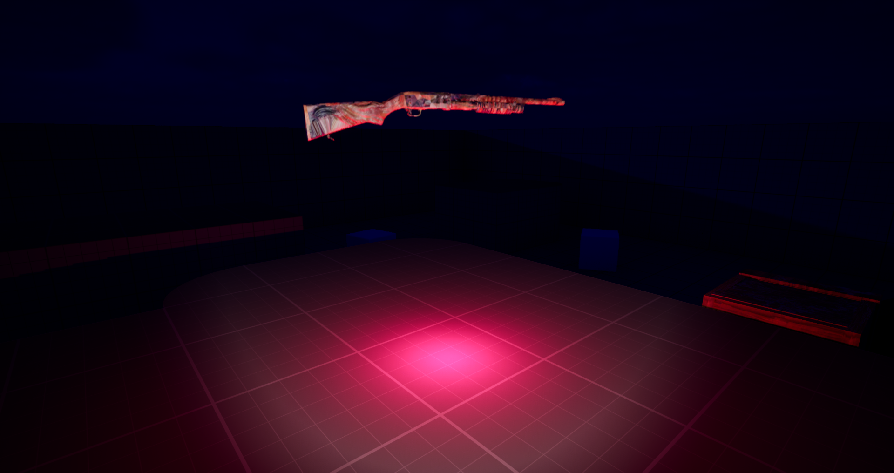
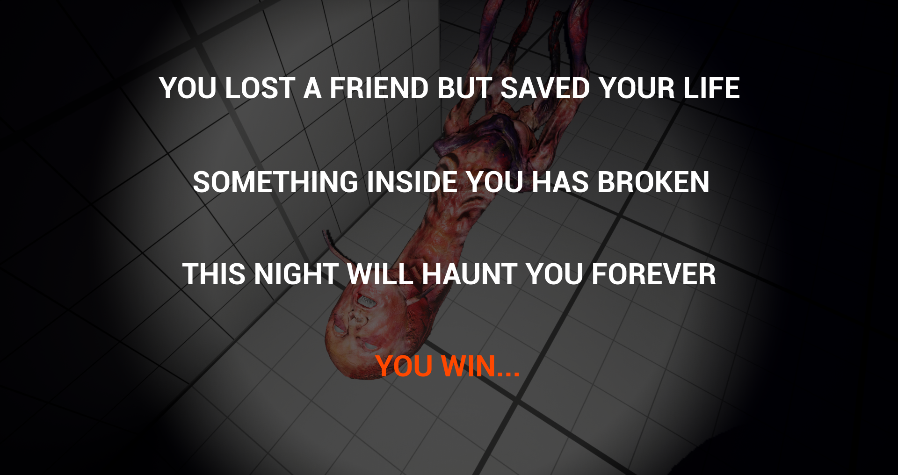
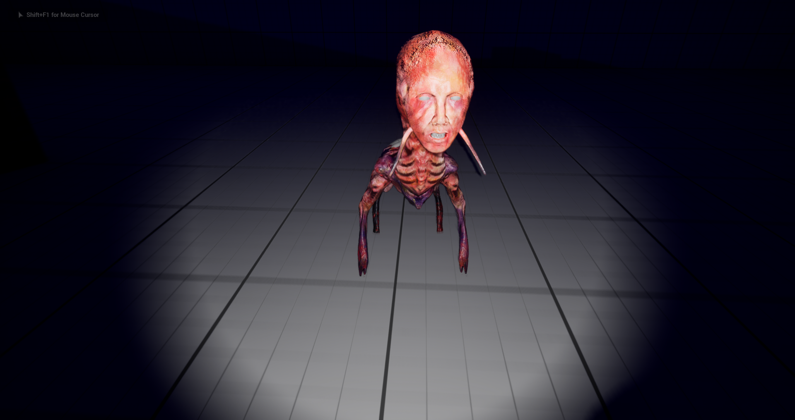
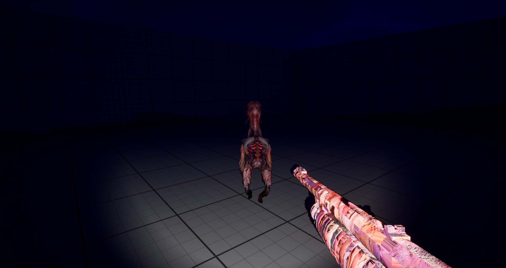
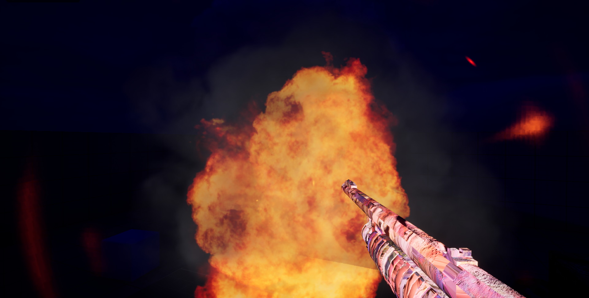
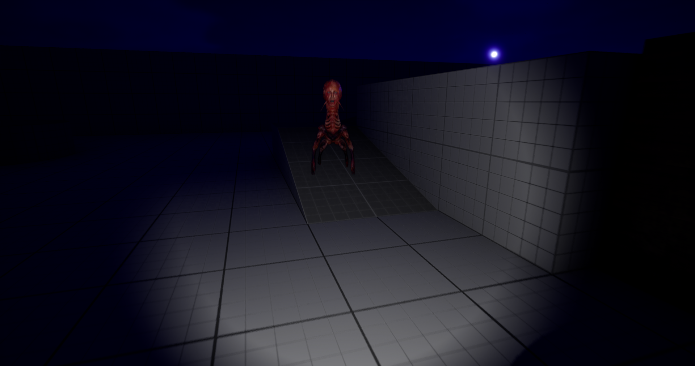

# Beyond Redemption

 

| [📖 Concept](#concept) |[🎮 Preview](#preview) | [🖱 Gameplay](#gameplay) | [📷 Screenshots](#screenshots) | [🔖 License](#license) |
| -------- | --------------- | --------------- | -------- | ----------- |

 

## Concept

_Dirty, grimy, moldy._
 
 
_The place where rest **dozens of memories**._
 
 
_Mementos of a past friendship brought you to this lair._
 
 
_And a **bad deed** that you don't even remember to commit._
 
 
_A **grotesque bald monster** takes his place, months ago a **normal friend**._
 
 
_His eyes gleam with rage in the darkness. Apparently, you have misbehaved._
 
 
_Each memento you collect fuels **his hatred** towards you._
 
 
_But do not pity the coward that hides in the shadows._
 
 
_And try to **fix** what seems forever broken._
 
 

## Preview

 
 

## Gameplay

- Press F to turn the flashlight On and Off.
- Press E to interact with objects.
- Press the left mouse button to shoot.
- Hide inside closets.
- Look out for mementos on the map.
- Find a weapon and finish off your pursuer.

 
 

## Screenshots

## License
Copyright ©️ 2023 Ricardo Baloira Armas

Credit to [SkinRender](https://www.cgtrader.com/skinrender-artworks) for the creepy 3D monster
